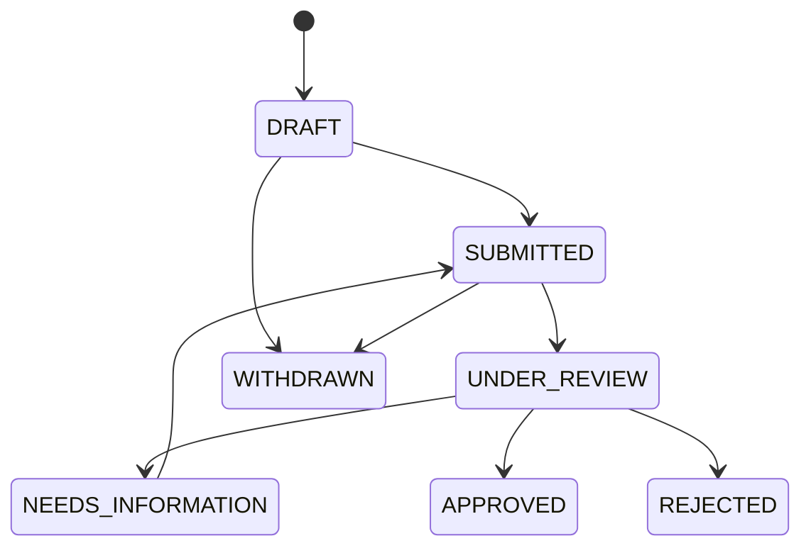
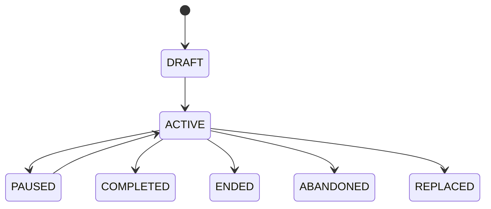
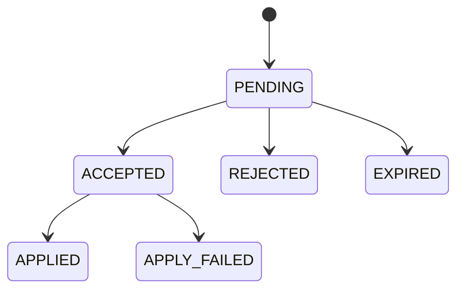

# Domain lifecycles

## Trainer eligibility

Trainer Application and runtime eligibility are intentionally separate.

Approval results in a verified capability only when verification policy is satisfied. Verification may later become `REVOKED` or `EXPIRED`; operational activity may independently be `ACTIVE`, `INACTIVE`, or `SUSPENDED`.

## Coaching Relationship and Coaching Period

A relationship may be `PENDING`, `ACTIVE`, `PAUSED`, `ENDED`, or `REJECTED`. Each period records the effective mode and responsible Trainer when applicable.

- `SELF_DIRECTED` to `HUMAN_COACH`: create a new period after relationship activation; preserve Goal and history unless the Student explicitly starts a new Goal.
- `HUMAN_COACH` to `SELF_DIRECTED`: end the Trainer-authority period; retain accepted plans and history under Student control according to policy.
- Trainer A to Trainer B: end A's authority and future-data access, create a new period for B, and explicitly grant allowed pre-coaching history.

## Fitness Goal

- Goal Proposal: `PENDING` to `ACCEPTED` or `REJECTED`.
- Same journey changed: create Goal Version with `effective_from`.
- New journey: close/replace old Goal, create new Goal, and record Goal Transition.
- Pause or inactivity does not delete elapsed calendar time or Workout/Measurement history.

### Goal Pause and Resume (GOAL-05)
- **Lifecycle Transition**: `ACTIVE -> PAUSED -> ACTIVE`.
  - Pause is allowed only when status is `ACTIVE`.
  - Resume is allowed only when status is `PAUSED`.
- **Authority Policy**:
  - Strictly restricted to the Student who owns the personal Fitness Goal.
  - Non-owner Students: HTTP 403 (`ACCESS_DENIED`).
  - Personal Trainers or Platform Administrators without Student capability: HTTP 403 (`STUDENT_CAPABILITY_UNAVAILABLE`).
  - Student account suspended/unavailable: HTTP 403 (`ACCOUNT_UNAVAILABLE`).
  - Missing student profile: HTTP 404 (`STUDENT_PROFILE_NOT_FOUND`).
  - Unauthenticated requests: HTTP 401 (`UNAUTHORIZED`).
  - AI service has no business authority.
- **Timeline & Target-Date Policy**:
  - Pausing does not erase elapsed calendar time. Calendar duration and active training duration are distinct concepts.
  - Resume does NOT automatically shift or extend `target_date` or target dates of `GoalTarget`.
  - `duration_days` remains unchanged.
  - If a student wishes to adjust target dates or timeline after resuming, that represents a strategic same-journey change requiring a new Goal Version (GOAL-03).
  - Locked goal versions (`locked_at IS NOT NULL`) are never directly mutated; `resume_date` is not written to locked versions.
- **Data Integrity & Missing Data Policy**:
  - Missing workouts, measurements, or nutrition logs during a pause period remain `UNKNOWN` / `NULL`, never materialized as zero.
  - Status history (`fitness.fitness_goal_status_history`) preserves the complete immutable record of all pause intervals (`ACTIVE -> PAUSED` and `PAUSED -> ACTIVE` with actor, timestamp, and reason).
  - Active duration can be calculated deterministically by excluding paused intervals recorded in status history (for the Milestone 5 Progress Engine).
- **Client & Scope Boundary**:
  - GOAL-05 implements backend domain, API, concurrency, persistence, and audit. Mobile UI integration is deferred to GOAL-06.

## Workout Plan and execution

Workout Plan has ordered versions for significant change. Planned sessions generated from a version retain that source reference. Minor adjustments record a scoped change without rewriting the version that originally produced historical sessions.

A Planned Workout can be scheduled, completed, skipped, cancelled, or rescheduled according to product policy. An Actual Workout records performed facts and may reference the original Planned Workout even when performed on another date.

## Appointment and change request

Appointments may use `SCHEDULED`, `CONFIRMED`, `COMPLETED`, `CANCELLED`, or `ABSENT`. A Change Request may use `PENDING`, `ACCEPTED`, `REJECTED`, `CANCELLED`, or `EXPIRED`.

Acceptance is transactional: validate request state, authorization, recurrence scope, and conflicts; update the occurrence/series; append change history; then publish notifications.

## Nutrition Goal and Target

Nutrition Goal supports `DRAFT`, `ACTIVE`, `PAUSED`, `COMPLETED`, `ENDED`, `REPLACED`, and optionally `ABANDONED`. Daily adherence does not complete a Goal by itself.

Nutrition Proposal supports `PENDING`, `ACCEPTED`, `REJECTED`, and `EXPIRED`. Acceptance creates a new strategic Target Version or a new Nutrition Goal depending on proposal intent. Effective dates determine which target applies to a historical day.

## AI Recommendation

Validation failure occurs before a recommendation becomes applicable. Application rechecks current authority, source version, and conflicts to prevent stale recommendations from overwriting newer decisions.

## Administration workflows

- Account: `ACTIVE`, `SUSPENDED`, `DISABLED`, `LOCKED`, `PENDING_DELETION`, `DELETED`.
- Exercise: `DRAFT`, `ACTIVE`, `ARCHIVED`; referenced content is not hard-deleted.
- Knowledge Version: `DRAFT`, `ACTIVE`, `ARCHIVED`; active content is replaced by publishing a new reviewed version.
- Moderation Case: `OPEN`, `UNDER_REVIEW`, `ACTION_REQUIRED`, `ESCALATED`, `RESOLVED`, `DISMISSED`.
- Support Case: `OPEN`, `IN_PROGRESS`, `WAITING_USER`, `RESOLVED`, `CLOSED`.

