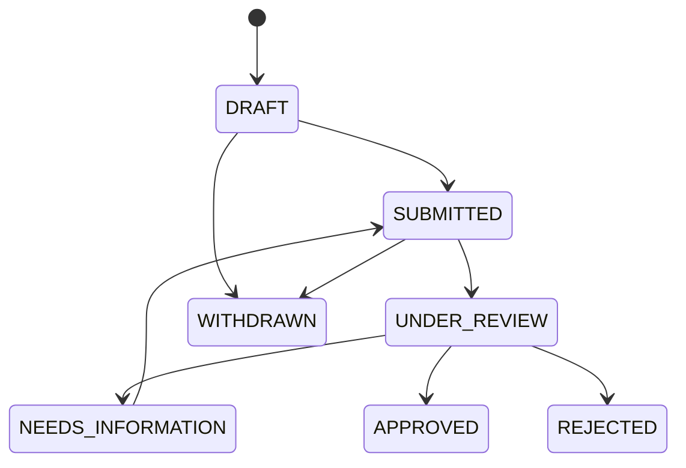
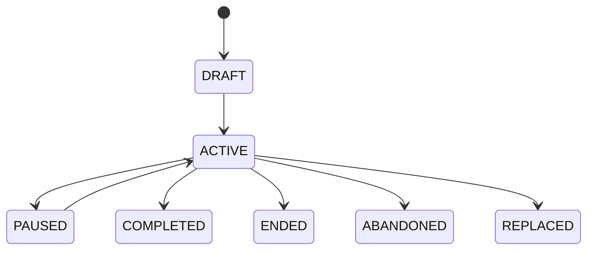
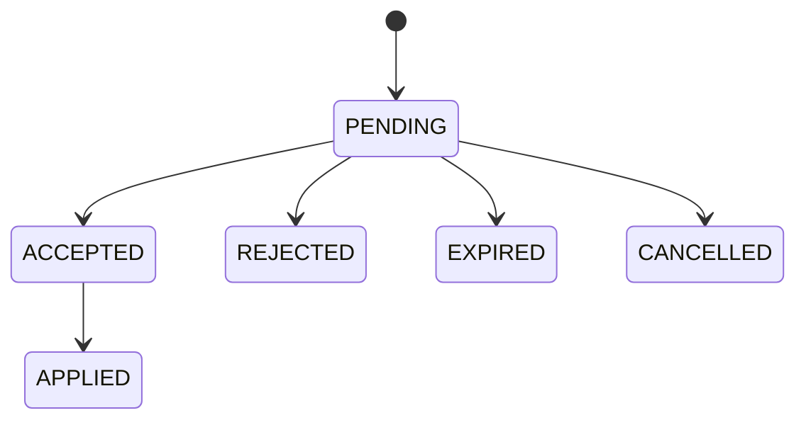

# Domain lifecycles

## Trainer eligibility

Trainer Application and runtime eligibility are intentionally separate.

```mermaid
stateDiagram-v2
    [*] --> DRAFT
    DRAFT --> SUBMITTED
    SUBMITTED --> UNDER_REVIEW
    UNDER_REVIEW --> NEEDS_INFORMATION
    NEEDS_INFORMATION --> SUBMITTED
    UNDER_REVIEW --> APPROVED
    UNDER_REVIEW --> REJECTED
    DRAFT --> WITHDRAWN
    SUBMITTED --> WITHDRAWN
```

Approval results in a verified capability only when verification policy is satisfied. Verification may later become `REVOKED` or `EXPIRED`; operational activity may independently be `ACTIVE`, `INACTIVE`, or `SUSPENDED`.

## Coaching Relationship and Coaching Period

A relationship may be `PENDING`, `ACTIVE`, `PAUSED`, `ENDED`, or `REJECTED`. Each period records the effective mode and responsible Trainer when applicable.

- `SELF_DIRECTED` to `HUMAN_COACH`: create a new period after relationship activation; preserve Goal and history unless the Student explicitly starts a new Goal.
- `HUMAN_COACH` to `SELF_DIRECTED`: end the Trainer-authority period; retain accepted plans and history under Student control according to policy.
- Trainer A to Trainer B: end A's authority and future-data access, create a new period for B, and explicitly grant allowed pre-coaching history.

## Fitness Goal

```mermaid
stateDiagram-v2
    [*] --> DRAFT
    DRAFT --> ACTIVE
    ACTIVE --> PAUSED
    PAUSED --> ACTIVE
    ACTIVE --> COMPLETED
    ACTIVE --> ENDED
    ACTIVE --> ABANDONED
    ACTIVE --> REPLACED
```

- Goal Proposal: `PENDING` to `ACCEPTED` or `REJECTED`.
- Same journey changed: create Goal Version with `effective_from`.
- New journey: close/replace old Goal, create new Goal, and record Goal Transition.
- Pause or inactivity does not delete elapsed calendar time or Workout/Measurement history.

### Goal Pause and Resume (GOAL-05)
- **Lifecycle Transition**: `ACTIVE -> PAUSED -> ACTIVE`.
  - Pause is allowed only when status is `ACTIVE`.
  - Resume is allowed only when status is `PAUSED`.
- **Authority Policy**:
  - Strictly restricted to the Student who owns the personal Fitness Goal.
  - Non-owner Students: HTTP 403 (`ACCESS_DENIED`).
  - Personal Trainers or Platform Administrators without Student capability: HTTP 403 (`STUDENT_CAPABILITY_UNAVAILABLE`).
  - Student account suspended/unavailable: HTTP 403 (`ACCOUNT_UNAVAILABLE`).
  - Missing student profile: HTTP 404 (`STUDENT_PROFILE_NOT_FOUND`).
  - Unauthenticated requests: HTTP 401 (`UNAUTHORIZED`).
  - AI service has no business authority.
- **Timeline & Target-Date Policy**:
  - Pausing does not erase elapsed calendar time. Calendar duration and active training duration are distinct concepts.
  - Resume does NOT automatically shift or extend `target_date` or target dates of `GoalTarget`.
  - `duration_days` remains unchanged.
  - If a student wishes to adjust target dates or timeline after resuming, that represents a strategic same-journey change requiring a new Goal Version (GOAL-03).
  - Locked goal versions (`locked_at IS NOT NULL`) are never directly mutated; `resume_date` is not written to locked versions.
- **Data Integrity & Missing Data Policy**:
  - Missing workouts, measurements, or nutrition logs during a pause period remain `UNKNOWN` / `NULL`, never materialized as zero.
  - Status history (`fitness.fitness_goal_status_history`) preserves the complete immutable record of all pause intervals (`ACTIVE -> PAUSED` and `PAUSED -> ACTIVE` with actor, timestamp, and reason).
  - Active duration can be calculated deterministically by excluding paused intervals recorded in status history (for the Milestone 5 Progress Engine).
- **Client & Scope Boundary**:
  - GOAL-05 implements backend domain, API, concurrency, persistence, and audit. Mobile UI integration is deferred to GOAL-06.

### Goal Authorization & Lifecycle Verification Matrix (GOAL-07)

The following matrix documents the verified invariants across role permissions, coaching relationships, coaching periods, data sharing permissions, goal states, and side effect guarantees:

| Operation | Actor Role | Relationship / Period / Permission | Goal / Proposal State | Expected Status & Error Code | Persisted Side Effects & Integrity |
|---|---|---|---|---|---|
| Create Goal (`activateImmediately=true`) | Unauthenticated | N/A | None | 401 Unauthorized | No DB write |
| Create Goal (`activateImmediately=true`) | TRAINER / ADMIN | N/A | None | 403 `STUDENT_CAPABILITY_UNAVAILABLE` | No DB write |
| Create Goal (`activateImmediately=true`) | STUDENT | N/A | Existing ACTIVE goal | 409 `ACTIVE_FITNESS_GOAL_ALREADY_EXISTS` | Zero partial writes; existing goal untouched |
| Create Goal (`activateImmediately=true`) (Concurrent) | STUDENT | N/A | None | 1x 201 Created, 1x 409 `ACTIVE_FITNESS_GOAL_ALREADY_EXISTS` | Concurrency lock allows exactly 1 active goal |
| Activate Goal | STUDENT | N/A | DRAFT | 200 OK | Status -> ACTIVE, status history appended, audit log created |
| Activate Goal | STUDENT | N/A | ACTIVE | 409 `INVALID_LIFECYCLE_TRANSITION` | No state change, no duplicate history |
| Activate Goal | STUDENT | N/A | PAUSED | 409 `INVALID_LIFECYCLE_TRANSITION` | Must use `/resume`; no state change |
| Activate Goal | STUDENT | N/A | COMPLETED, ENDED, ABANDONED, REPLACED | 409 `INVALID_LIFECYCLE_TRANSITION` | Terminal goals cannot be activated |
| Activate Goal | TRAINER / ADMIN | N/A | DRAFT | 403 `STUDENT_CAPABILITY_UNAVAILABLE` | No DB write |
| Pause Goal | STUDENT (Owner) | N/A | ACTIVE | 200 OK | Status -> PAUSED, status history appended, audit log created |
| Pause Goal | STUDENT (Owner) | N/A | PAUSED | 409 `GOAL_LIFECYCLE_CONFLICT` | No state change, no duplicate history |
| Pause Goal | STUDENT (Owner) | N/A | DRAFT / Terminal | 409 `GOAL_LIFECYCLE_CONFLICT` | Cannot pause non-active goal |
| Pause Goal | Non-owner STUDENT | N/A | ACTIVE | 403 `ACCESS_DENIED` | No state change |
| Pause Goal | TRAINER / ADMIN | N/A | ACTIVE | 403 `STUDENT_CAPABILITY_UNAVAILABLE` | No state change |
| Resume Goal | STUDENT (Owner) | N/A | PAUSED | 200 OK | Status -> ACTIVE, status history appended, audit log created |
| Resume Goal | STUDENT (Owner) | N/A | ACTIVE / DRAFT / Terminal | 409 `GOAL_LIFECYCLE_CONFLICT` | Cannot resume non-paused goal |
| Resume Goal | Non-owner STUDENT | N/A | PAUSED | 403 `ACCESS_DENIED` | No state change |
| Resume Goal | TRAINER / ADMIN | N/A | PAUSED | 403 `STUDENT_CAPABILITY_UNAVAILABLE` | No state change |
| Create Version | STUDENT (Owner) | N/A | ACTIVE | 201 Created | New version open (`effective_until IS NULL`), previous version closed, audit logged |
| Create Version | STUDENT (Owner) | N/A | PAUSED | 409 `INVALID_LIFECYCLE_TRANSITION` | No new version; version creation prohibited while paused |
| Create Version | STUDENT (Owner) | N/A | DRAFT / Terminal | 409 `INVALID_LIFECYCLE_TRANSITION` | Non-active goals cannot be versioned |
| Create Version | Non-owner STUDENT | N/A | ACTIVE | 403 `ACCESS_DENIED` | No DB write |
| Create Version | TRAINER / ADMIN | N/A | ACTIVE | 403 `STUDENT_CAPABILITY_UNAVAILABLE` | Direct versioning requires student ownership |
| Create Transition | STUDENT (Owner) | N/A | ACTIVE | 201 Created | Old goal -> REPLACED, new goal -> ACTIVE, transition row created, workout/nutrition plans retained on old goal |
| Create Transition | STUDENT (Owner) | N/A | PAUSED | 409 `INVALID_LIFECYCLE_TRANSITION` | Cannot transition paused goal |
| Create Transition | STUDENT (Owner) | N/A | Terminal | 409 `INVALID_LIFECYCLE_TRANSITION` | Cannot transition terminal goal |
| Create Transition | TRAINER / ADMIN | N/A | ACTIVE | 403 `STUDENT_CAPABILITY_UNAVAILABLE` | Direct transition requires Student ownership |
| Create Proposal | TRAINER | ACTIVE relationship, active period, valid data sharing | Student goal ACTIVE | 201 Created | Proposal PENDING created, audit logged |
| Create Proposal | TRAINER | No relationship | Student goal ACTIVE | 403 `COACHING_RELATIONSHIP_REQUIRED` | No DB write |
| Create Proposal | TRAINER | Relationship ENDED / PAUSED | Student goal ACTIVE | 403 `COACHING_RELATIONSHIP_REQUIRED` | No DB write |
| Create Proposal | TRAINER | Period expired (`ended_at < now()`) | Student goal ACTIVE | 403 `COACHING_RELATIONSHIP_REQUIRED` | No DB write |
| Create Proposal | TRAINER | Permission revoked / expired | Student goal ACTIVE | 403 `DATA_SHARING_PERMISSION_REQUIRED` | No DB write |
| Create Proposal | TRAINER | Unassigned Trainer | Student goal ACTIVE | 403 `COACHING_RELATIONSHIP_REQUIRED` | Cross-trainer isolation enforced |
| Create Proposal | ADMIN | N/A | Student goal ACTIVE | 403 `ACCESS_DENIED` | Admin cannot propose coaching changes |
| Create Proposal | TRAINER | Valid coaching relationship | Student goal PAUSED / Terminal | 409 `INVALID_LIFECYCLE_TRANSITION` | Cannot propose changes to non-active goal |
| Decide Proposal (Accept) | STUDENT (Owner) | N/A | Proposal PENDING, goal ACTIVE | 200 OK | Proposal -> ACCEPTED; creates new version or replaces goal depending on intent; proposal status history appended |
| Decide Proposal (Reject) | STUDENT (Owner) | N/A | Proposal PENDING, goal ACTIVE | 200 OK | Proposal -> REJECTED; proposal status history appended; student goal, versions, targets remain unchanged |
| Decide Proposal | STUDENT (Owner) | N/A | Proposal ACCEPTED / REJECTED | 409 `GOAL_PROPOSAL_ALREADY_DECIDED` | Terminal proposal state cannot be decided again |
| Decide Proposal | TRAINER / ADMIN | N/A | Proposal PENDING | 403 `ACCESS_DENIED` | Only Student has decision authority |

> [!NOTE]
> **Duplicate Lifecycle Replay Safety:** The current contract handles repeated or duplicate lifecycle mutations (activate, pause, resume) safely by returning deterministic 409 Conflict status codes with zero duplicate status history or audit log creation. This establishes duplicate lifecycle replay safety; client-specified `Idempotency-Key` headers are not part of the current REST contract and are not claimed.

## Workout Plan and execution

Workout Plan has ordered versions for significant change. Planned sessions generated from a version retain that source reference. Minor adjustments record a scoped change without rewriting the version that originally produced historical sessions.

A Planned Workout can be scheduled, completed, skipped, cancelled, or rescheduled according to product policy. An Actual Workout records performed facts and may reference the original Planned Workout even when performed on another date.

## Appointment and change request

Appointments may use `SCHEDULED`, `CONFIRMED`, `COMPLETED`, `CANCELLED`, or `ABSENT`. A Change Request may use `PENDING`, `ACCEPTED`, `REJECTED`, `CANCELLED`, or `EXPIRED`.

Acceptance is transactional: validate request state, authorization, recurrence scope, and conflicts; update the occurrence/series; append change history; then publish notifications.

## Nutrition Goal and Target

Nutrition Goal supports `DRAFT`, `ACTIVE`, `PAUSED`, `COMPLETED`, `ENDED`, `REPLACED`, and optionally `ABANDONED`. Daily adherence does not complete a Goal by itself.

Nutrition Proposal supports `PENDING`, `ACCEPTED`, `REJECTED`, and `EXPIRED`. Acceptance creates a new strategic Target Version or a new Nutrition Goal depending on proposal intent. Effective dates determine which target applies to a historical day.

## AI Recommendation

```mermaid
stateDiagram-v2
    [*] --> PENDING
    PENDING --> ACCEPTED
    PENDING --> REJECTED
    PENDING --> EXPIRED
    ACCEPTED --> APPLIED
    PENDING --> CANCELLED
```

Validation failure occurs before a recommendation becomes applicable. Application rechecks current authority, source version, and conflicts to prevent stale recommendations from overwriting newer decisions.

The diagram uses the existing recommendation DB enum. `APPLY_FAILED` is not a persisted enum value; application failure is an operational error. The [Phase 2 V1 proposal](../08-ai/recommendation-lifecycle.md#phase-2-v1-transaction-proposal-draft) keeps ACCEPTED and APPLIED in the same transaction with domain writes and mandatory audit, rolling back all of them on failure. This transaction choice remains DRAFT; the diagram does not claim an implemented asynchronous Apply flow. INFORMATION and Nutrition ESTIMATE do not enter this recommendation lifecycle.

## Administration workflows

- Account: `ACTIVE`, `SUSPENDED`, `DISABLED`, `LOCKED`, `PENDING_DELETION`, `DELETED`.
- Exercise: `DRAFT`, `ACTIVE`, `ARCHIVED`; referenced content is not hard-deleted.
- Knowledge Version: `DRAFT`, `ACTIVE`, `ARCHIVED`; active content is replaced by publishing a new reviewed version.
- Moderation Case: `OPEN`, `UNDER_REVIEW`, `ACTION_REQUIRED`, `ESCALATED`, `RESOLVED`, `DISMISSED`.
- Support Case: `OPEN`, `IN_PROGRESS`, `WAITING_USER`, `RESOLVED`, `CLOSED`.

