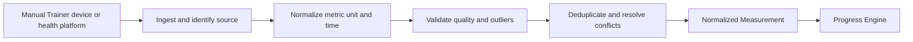

# Data flows

## Workout recommendation

1. Student or Trainer requests analysis through Mobile.
2. Spring Boot authenticates the caller and determines current Coaching Period, authority, relationship, and data scope.
3. Progress Engine supplies validated Goal progress, trends, adherence, continuity, and quality signals.
4. Context Builder adds only request-relevant profile, equipment, schedule, plan, and history data; missing/stale/suspect fields are labelled.
5. Rule Engine blocks unsafe or unsupported scenarios, such as normal progression after long inactivity.
6. RAG retrieves eligible active Knowledge Chunks when the request needs professional knowledge.
7. The model returns schema-constrained output.
8. Validator checks exercises, equipment, load/volume constraints, references, and authority.
9. Spring Boot persists an AI Run and, when valid, a pending AI Recommendation.
10. The responsible Student or Trainer accepts/rejects it. Acceptance rechecks source plan version and creates the appropriate minor change or new plan version.

## Measurement ingestion

Raw provider payload may be retained according to privacy and retention policy, but only normalized validated Measurements feed ordinary progress calculations. Rejected/suspect data remains traceable and is not passed to AI as certain truth.

## Nutrition AI

1. Student submits an image or text description.
2. AI recognizes candidate foods/ingredients and estimates quantity/portion.
3. Candidates are matched to structured Nutrition Database records.
4. The Student confirms or corrects identity and quantity.
5. Nutrition Calculation Engine deterministically calculates calories/macros.
6. Confirmed Food Log Items store estimate/confirmation/correction provenance.
7. Progress Engine uses Food Logs together with logging completeness and the effective Daily Target.

## Reschedule acceptance

1. Student or Trainer proposes a new time and recurrence scope.
2. Backend performs preliminary authorization and conflict checks.
3. The other party accepts or rejects.
4. On acceptance, the backend locks/reloads required state and rechecks request status, time conflicts, Trainer eligibility, and scope.
5. Appointment occurrence/series and change history update atomically.
6. Notification events are published after commit.
7. Planned Workout remains unchanged unless an explicit workout scheduling action is also requested.

## Admin data correction

1. Authorized Admin opens a Support Case.
2. If sensitive data is required, privileged access is granted for a limited scope/time/reason.
3. Admin proposes a Data Correction Action with before/after and reason.
4. The owning domain application service validates invariants and applies or rejects the correction.
5. Case, correction result, and immutable audit entries are linked.

