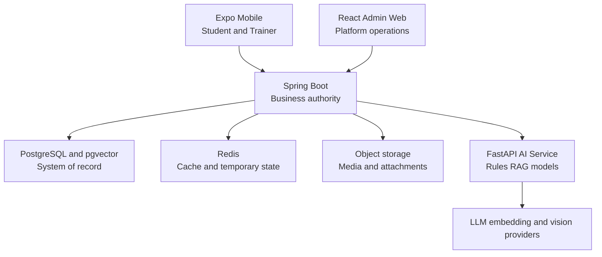

# System architecture

The target architecture combines a React Native mobile application, a React Admin Web application, a Spring Boot modular monolith, a separate FastAPI AI service, PostgreSQL with pgvector, Redis, and object storage.

## Runtime responsibilities

### Mobile

Expo/React Native serves Student and Trainer workflows. It uses TypeScript, Expo Router, TanStack Query, Axios, Zustand, and React Hook Form. It may use camera and media features for Progress Photos and food images. It never accesses PostgreSQL or the AI service directly.

### Admin Web

React/Vite serves data-heavy platform governance workflows: accounts and permissions, Trainer verification, moderation/support, Exercise and Knowledge content, AI operations, integrations/jobs, audit, and configuration. Screens expose only capabilities permitted to the signed-in Administrator.

### Spring Boot backend

Spring Boot is the business authority, authorization boundary, transaction coordinator, and system-of-record API. It owns authentication, domain validation, lifecycle transitions, versioning, audit, AI orchestration, and persistence.

### FastAPI AI service

FastAPI handles model-facing workloads: AI Assistance, rule execution where assigned, RAG, embeddings, prompt assembly, structured output processing, nutrition vision, and evaluation. It does not freely query or mutate application tables. Spring Boot sends an authorized request context and validates the response before any business application.

### Data infrastructure

- PostgreSQL stores normalized business and audit data.
- pgvector stores embeddings for approved Knowledge Chunks.
- Redis stores cache, rate limits, presence, OTP/temporary tokens, short-lived job state, and safe short-lived AI cache.
- Object storage stores avatars, Progress Photos, food images, exercise media, chat attachments, and documents; PostgreSQL stores metadata and object references.

## Request and authority rules

1. Mobile/Admin authenticate and call versioned Spring Boot REST APIs or WebSocket channels.
2. Spring Boot authorizes the operation and loads only permitted data.
3. For AI work, Spring Boot/AI orchestration builds or requests a minimized context and calls FastAPI internally.
4. FastAPI runs rules/retrieval/models and returns structured output plus validation metadata.
5. Spring Boot validates schema, references, authority, versions, safety, and business invariants.
6. Applicable output is stored as a pending Recommendation/Proposal.
7. The authorized human accepts or rejects it; application revalidates current state transactionally.

## Evolution strategy

The backend remains a modular monolith until evidence justifies extraction. Candidate triggers include separately scaling computer-vision inference, isolated failure domains, materially different deployment cadence, or clear team ownership. Extraction must preserve contracts, auditability, and business authority in Spring Boot unless an explicit architecture decision changes it.

