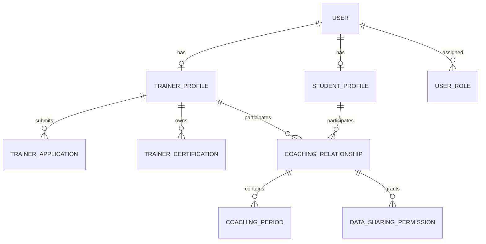
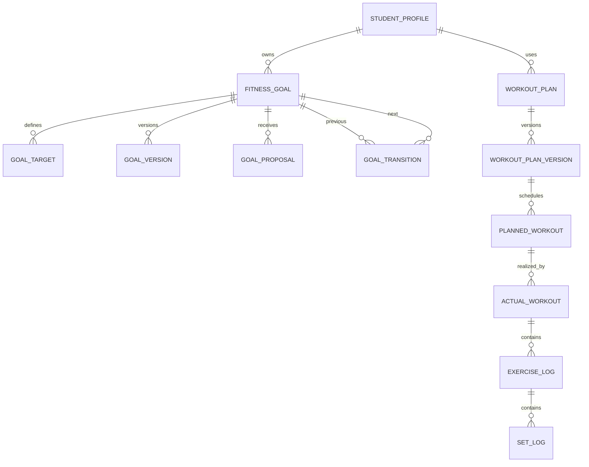

# Conceptual data model

This model is intentionally conceptual. Physical schemas must preserve these identities, lifecycles, effective dates, ownership rules, and historical references.

## Identity and coaching

Trainer Profile existence, verification status, activity status, relationship state, and permission scope are separate facts.

## Goals and workout

Historical sessions reference the source plan version. Significant changes append versions. Actual facts are not rewritten to match a plan.

## Schedule

Appointment identifies Trainer, Student, start/end, timezone, location/type, status, and optional related Planned Workout. Recurrence/series metadata is separate from occurrence state. Change Request stores initiator, original/proposed times, recurrence scope, reason, status, creation/response time, and final change reference. Change History retains each accepted transition.

## Measurement and progress

Metric Definition describes metric identity, value type, canonical unit, allowed conversion, and semantic metadata. Measurement records Student, metric, value, unit/canonical value, measured time, received time, source, method, provenance, provider/external reference, validation status, quality/confidence, and deduplication relationship.

Training Activity Period records active/inactive time ranges and reason/source. Progress-derived data may be computed on demand or materialized with calculation version, source window, evidence references, and calculation time.

## Nutrition

Nutrition Goal is Student-owned and may link to a Fitness Goal for alignment. Nutrition Proposal references the source version and proposed strategic change. Nutrition Target Version uses effective dates and may own day-type rules. Daily Target resolves the applicable version/rule plus an optional Daily Override. Meal and Food Log Item store actual intake. Food estimates store AI provenance and Student confirmation/correction state.

## AI and knowledge

Knowledge Document owns ordered Knowledge Versions. A version owns chunks and embeddings and has `DRAFT`, `ACTIVE`, or `ARCHIVED` status. AI Run stores request/model/prompt/input references/output/validation/latency/usage. AI Recommendation references its Run, target resource/version, status, decision actor/time, and application result.

## Administration and audit

Admin Role maps to Permissions. Moderation Case, Support Case, Privileged Data Access, Data Correction Action, Feature Flag, System Configuration, Job Execution, and Integration Status are explicit platform records. Audit Log is append-only from the Admin UI perspective and identifies actor, action, target, before/after or change reference, request/correlation, reason, and time as policy permits.

## Index candidates

Indexes follow measured queries. Likely candidates include:

- set/exercise/actual workout history by Student and performed time;
- appointments by Trainer/Student and time range;
- messages by conversation and creation time;
- measurements by Student, metric, and measured time;
- food logs by Student and logged day;
- active relationships/periods and effective versions;
- pending proposals/recommendations/change requests;
- Attention Signals by assignee, status, priority, and detected time.

