# B03 Coaching Relationship and Coaching Period

## 1. Checkpoint and objective

- **Feature ID:** `B03`.
- **Current implementation checkpoint:** `B03-COACHING-PERIOD-SHARING`.
- **Checkpoint branch:** `feature/m2c-coaching-period-sharing`.
- **Scope of this checkpoint:** backend/schema/OpenAPI sharing authority; Mobile remains out of scope.
- **CONFIRMED REQUIREMENT:** Establish the relationship, effective-period, sharing, and authorization rules for Student-Trainer coaching without deleting or rewriting fitness history.

This record distinguishes confirmed product requirements, executable evidence, and later decisions. The original prerequisite decision gate was merged by PR #40 at `795a84f00a514451d7e37197091c037beb2bfbb3` (decision parent `78d6de6d5053c1cd4038ce19d2483adc7004ebbe`). Relationship lifecycle is implemented through V24-V26. The current sharing checkpoint adds V27, Coaching-owned sharing/authority ports and services, Student-owned sharing commands, Goal delegation, and the OpenAPI sharing contract. Mobile statements remain requirements for a later checkpoint, not implementation claims.

### B03-RELATIONSHIP-LIFECYCLE implementation boundary

- Implemented locally: Student request, Trainer invitation, bilateral initial/resume decisions, pause/end, participant/current/pending/status-history/resume-decision-history queries, version guards, module-owned command receipts, transaction-scoped audit, and the minimum effective Coaching Period close/open behavior. V24 adds relationship version/initiator constraints, Student-current uniqueness, pending-resume persistence, and history guards. V4 already provides pair uniqueness and period non-overlap; V12 provides pair consistency.
- Initial acceptance creates the first `HUMAN_COACH` period if no current period exists; it does not fabricate historical `SELF_DIRECTED` coverage before B03. Pause and active end close the human period and begin a new self-directed period at one boundary. Resume acceptance closes that self-directed period and creates a new human period. Ending a paused relationship retains the already-open self-directed period.
- A legacy `ACTIVE` relationship lacking any effective period had no Trainer data authority under the existing Goal policy. Pause/end can still revoke it and open self-directed authority without inventing the missing historical human period. End of a legacy `PAUSED` relationship with no period likewise opens self-directed authority; an inconsistent *present* period remains a stable conflict.
- No Trainer data-sharing authority is granted by relationship or period alone. At the lifecycle checkpoint, Goal's existing grant-aware authority adapter remained in place for compatibility; the current sharing checkpoint replaces that direct persistence access with the Coaching-owned authority port. ST-17/TR-01/TR-03/TR-12 UI belongs to the Mobile checkpoint.
- Initiation, acceptance, resume-request creation, resume acceptance, and active Trainer reads recheck canonical Trainer eligibility. A participant with an active account/capability may still pause or end an existing relationship after Trainer eligibility is lost, so revocation is never blocked by the lost eligibility. A former Trainer's ended-relationship detail/history is concealed; the Student retains own history.
- Exact replay of an actor-scoped `commandKey` with the same command and payload returns the recorded relationship/resume outcome without new history, period, or audit writes; the response's period projection is re-evaluated under current authority. Reuse with a different payload returns `COACHING_IDEMPOTENCY_CONFLICT` (409). Competing/stale commands receive stable 409 conflicts; failed transactions have no partial lifecycle effects.
- Command receipts retain a period-free relationship/resume outcome. Every new or replayed command response rechecks current account, capability, and participation, then projects the effective period for the actor: Student may see their own; Trainer sees only a matching period on their currently `ACTIVE` relationship while eligible. Pending, paused, ended, or ineligible Trainers never receive another Trainer's period or the Student's self-directed period.
- The four paginated Coaching queries (pending relationships, status history, period history, and resume-request history) use `page` 0–1,000,000 and `size` 1–100. Invalid values return the common `400 VALIDATION_FAILED` envelope without raw validation text; current-context and relationship-detail queries are not paginated.
- Status-history responses retain the `changedBy` property but allow `null` for legacy V4 rows whose `changed_by` was not recorded; the API never fabricates an actor or rewrites that history.
- The effective-period predicate is `started_at <= request/transition time AND (ended_at IS NULL OR ended_at > request/transition time)`. PostgreSQL supplies the authoritative mutation boundary after required locks are held. A finite future `ended_at` is still effective; closure atomically rechecks database time, so a period that expires after selection returns `409 COACHING_PERIOD_CONFLICT` and rolls back the whole command. A valid transition may shorten a scheduled end at its close/open boundary, but completed period history cannot be reopened or rewritten.

### B03-COACHING-PERIOD-SHARING implementation boundary

- V27 adds `VIEW`/`CONTRIBUTE`/`MANAGE`, optimistic sharing versions, the B04-traceability `WORKOUT_PLAN` scope, non-overlapping effective decisions, history/delete guards, and restrictive relationship/profile foreign keys. Legacy effective `FITNESS_GOAL ALLOW` decisions backfill to `CONTRIBUTE`; other legacy decisions backfill to `VIEW` without changing row identity or creation time.
- Student-owned grant-or-replace/revoke commands use actor-scoped command receipts, Student-boundary locking, monotonic replacement versions, immutable audit, and append/close history. Sharing history remains visible to an authenticated relationship participant, except that a former Trainer's ended relationship is concealed; Trainer or Admin cannot mutate on the Student's behalf.
- `CoachingAuthorityQuery` is the reusable module boundary. Current authority requires active account/capability, canonical Trainer eligibility, `ACTIVE` relationship, matching effective `HUMAN_COACH` period, effective `ALLOW`, scope, and sufficient level. Historical authority first requires current authority and then applies the explicit half-open history window.
- Goal no longer reads Coaching persistence directly. Proposal view delegates with minimum `VIEW`; proposal creation delegates with minimum `CONTRIBUTE`. `MANAGE` still cannot override Student-owned Goal decisions.
- Former Trainer sharing-history reads are concealed after `ENDED`. Sharing history and audit evidence remain preserved. Trainer access-request workflow and B04-B08 consumer implementations are not introduced here.

## 2. Sources and confirmed requirements

The decision is based on:

- `FR-GC-001`, `FR-GC-002`, `FR-GC-010`, and `FR-GC-011` in the functional requirements;
- the M2 scope and exit criteria in the Phase 1 implementation plan;
- the Coaching Relationship and Coaching Period lifecycle and the Trainer access checks in the domain documents;
- ST-17, TR-01, TR-03, and TR-12 in the UI/UX specifications;
- Flyway V1, V4, and V20 through the latest repository migration at the time of this audit;
- the current OpenAPI contract and the B01 identity/session and Trainer eligibility implementation;
- B02 authority, stable-error, audit, optimistic-concurrency, and history-preservation conventions;
- the B03 source document read from the untracked-files parent of the stash whose message is `wip Minh docs before rebasing B01`.

The following requirements are confirmed:

1. The only Coaching Modes are `SELF_DIRECTED` and `HUMAN_COACH`. AI Assistance is neither a mode nor an authority.
2. Coaching Mode belongs to an effective Coaching Period, never permanently to Student Profile.
3. Switching mode or Trainer creates period history and preserves Goals, Plans, Workouts, Measurements, Nutrition, Progress, RPE, and their historical references.
4. A Trainer role or profile alone never grants Student access. Backend authorization must also validate the active account, active capability, canonical Trainer eligibility, relationship, effective period, sharing scope and level, ownership, and operation-specific policy.
5. Data Sharing Permission must express domain/resource scope, access level, validity time, and explicit pre-coaching-history access.
6. Student owns personal data-sharing decisions and Student-owned Goal decisions. Trainer may request access or propose a Goal change; Trainer cannot grant access or accept a proposal on the Student's behalf.
7. Administrator is platform authority, not coaching authority. Support or privileged access uses a separate permission, purpose, expiry, and audit workflow.
8. Missing or unavailable data remains unknown. Lack of sharing is not the same as lack of data.

## 3. Existing schema, code, and contract audit

| Area | Executable evidence | Audit result |
|---|---|---|
| Relationship | V4 relationship/history tables plus V24 lifecycle/version/current-Student guards | Pair-level pending/current uniqueness, one `ACTIVE`/`PAUSED` relationship per Student, actor/status history, and optimistic lifecycle version are executable. |
| Initiation | V4 stores `requested_by`, Trainer, Student, and request time; V24 constrains the initiator to the pair | Request versus invitation is derived safely from `requested_by`; no parallel invitation table is needed. |
| Coaching Period | V4 mode/effective-time/non-overlap structure, V12 pair validation, and V24-V26 lifecycle/history guards | Pair consistency, half-open effective time, scheduled future end, atomic lifecycle close/open, and completed-history immutability are executable. |
| Sharing | V4 `data_sharing_permissions`, V20 `FITNESS_GOAL`, and V27 access level/version/non-overlap/history guards | Scope, decision, ordered level, validity, explicit historical window, optimistic version, and immutable revocation history are executable. |
| Trainer eligibility | `TrainerEligibilityService` derives eligibility from account, active Trainer role, active profile, and verification/activity state | This is the canonical eligibility input B03 consumes. Runtime policy-restriction and capacity checks are not implemented by this service; accepting-students is checked separately at initiation and acceptance. |
| Current coaching authority | `CoachingAuthorityQuery` evaluates canonical eligibility, relationship, period, scope, decision, validity and level; Goal delegates through this port | Coaching owns the policy and persistence. Consumer modules do not read Coaching repositories. |
| Audit and errors | The backend exposes structured errors with stable `errorCode`, request ID, timestamp and field errors; immutable audit services and B02 lifecycle/version conflict conventions exist | B03 reuses these shapes and audit conventions. Raw exception text does not become Mobile copy. |
| OpenAPI | Lifecycle and Student-owned sharing list/grant-or-replace/revoke paths and schemas exist | Stable validation, concealment, capability and concurrency errors use the common envelope. |
| Mobile | ST-17, TR-01, TR-03, and TR-12 are documented; no B03 routes or screens are implemented | Mobile work belongs to a later checkpoint and must reuse B01 session, capability, query-cache, error, and forced-logout behavior. |

## 4. Decision table

| Topic | Decision | Rationale and consequence |
|---|---|---|
| Relationship multiplicity | A Student may have at most one current relationship in `ACTIVE` or `PAUSED`. A Student may have pending requests/invitations with different Trainers, but each Student-Trainer pair has at most one current `PENDING`, `ACTIVE`, or `PAUSED` row. | Prevents two active coaches and makes resume deterministic. Accepting a pending relationship while another relationship is `ACTIVE` or `PAUSED` returns a stable conflict; the old relationship must be ended explicitly. |
| Effective authority | A Student has at most one effective Coaching Period at an instant. Trainer authority exists only for an `ACTIVE` relationship and a matching effective `HUMAN_COACH` period. | Reuses V4's exclusion constraint and denies authority during gaps, pause, or inconsistent data. |
| Initiation | An eligible, accepting Trainer may be invited by a Student; a Trainer may invite a Student. The counterparty must accept. The initiator cannot accept their own pending relationship. | A common pending relationship record is sufficient; `requested_by` identifies the direction. Eligibility is checked at initiation and again at acceptance. |
| Pending lifecycle | The initiator may cancel; only the counterparty may accept or reject. Reject/cancel are terminal and preserved. | Makes intent and authority explicit and provides deterministic replay conflicts. |
| Pause | Either party may pause an `ACTIVE` relationship unilaterally. Pause is immediate, audited, closes the effective `HUMAN_COACH` period, and opens a `SELF_DIRECTED` period at the same boundary. | Either party can withdraw active collaboration safely; paused coaching grants no Trainer access while the Student retains authority over personal data. |
| Resume | Resume requires both parties. Either party may create a resume request while the relationship remains `PAUSED`; at most one resume request may be pending for that relationship. The initiator may cancel it, while only the counterparty may accept or reject it. The initiator cannot accept their own request. Accept creates a new `HUMAN_COACH` period and never reopens or rewrites the prior period. | A Trainer cannot regain access unilaterally, and a Student cannot reassign coaching responsibility without Trainer consent. Resume-request state is separate from relationship status, so authority remains revoked until the accept transaction commits. |
| End | Either party may end an `ACTIVE` or `PAUSED` relationship with an explicit confirmation and reason. End is terminal. If a human-coach period is effective, it is closed and a `SELF_DIRECTED` period begins at the same boundary. | Consent/participation can be withdrawn without deleting history. A new collaboration creates a new relationship row. |
| Paused authority | `PAUSED` grants no Trainer read, contribute, manage, messaging-membership expansion, or plan authority. The Student keeps normal access to their own data. | Relationship status is an authorization input, not only presentation state. Existing grants remain historical but are ineffective while paused. |
| Ended authority and reads | `ENDED` removes all future coaching authority and all general access to live Student data. A former Trainer may see only minimal immutable receipts of their own prior actions when an owning module later defines a specific lawful/audited read contract; B03 grants no general historical Student-data access. | Preserves identifiers and audit evidence without silently retaining live access. Chat retention/read behavior remains a B08 policy, but cannot be used to regain live coaching data. |
| Sharing default | Deny by default. No role-derived or relationship-derived implicit grant exists. Student-issued, relationship-bound grants are required in addition to relationship/period/object authority. An effective `DENY` or the absence of a sufficient grant denies access. | Enforces least privilege and distinguishes relationship membership from sensitive-data consent. |
| Access levels | Add explicit `VIEW`, `CONTRIBUTE`, and `MANAGE`. Levels are ordered for sufficiency (`MANAGE` includes `CONTRIBUTE` and `VIEW`; `CONTRIBUTE` includes `VIEW`), but never override domain authority. | Meets FR-GC-011. For example, `MANAGE` never lets a Trainer accept a Student-owned Goal proposal, and `CONTRIBUTE` permits proposing only when the Goal module also authorizes it. |
| Grant/effective-authority time | Evaluate account, capability, eligibility, relationship, effective Coaching Period, and sharing-grant validity at the backend's current request time. Pause, revoke, expiry, or end removes authority for the current request even when the requested record was created earlier. | Current authority is one independent time axis. A historical record never preserves the authority that existed when it was created. |
| Historical-data window | Only after current authority succeeds, compare the historical resource's domain timestamp with the effective grant's explicit `history_from`/`history_until`. A pre-period record is readable only when its scope and historical window permit it. | Resource time is the second independent axis. A timestamp inside the historical window cannot create or revive authority, and a former Trainer cannot use it after pause/end. Student ownership access to the Student's own history is unaffected by Trainer grant windows. |
| Permission changes | Grant, replace, revoke, and expiry are history-preserving and audited. A change revokes/closes the prior effective row and appends a new row; it does not overwrite who granted the prior decision. | Supports consent history and deterministic effective-time evaluation. |
| Concurrency | Accept, pause, resume-request actions, end, period switch, and sharing changes lock/recheck the Student authority boundary and use expected versions or equivalent compare-and-set guards. Initial and resume acceptance use the fixed order Student profile -> Trainer account -> Trainer role -> Trainer profile, then recheck account, role, verification, activity, profile active state, and accepting-students under those row locks. Resume accept/reject/cancel addresses `resumeRequestId`, relationship ID, expected relationship version, and expected request version/concurrency token. Database constraints are the final race backstop. | Exactly one competing transition wins. Updates to the currently implemented eligibility inputs serialize on the locked source rows; if such an update commits first, acceptance observes it and fails without partial writes. If acceptance commits first, a later eligibility change revokes subsequent authority without rewriting the committed lifecycle history. |
| Deletion | Relationship, status history, period, sharing decision, and consumer references are never hard-deleted through B03. | Historical identifiers remain resolvable and downstream history is not rewritten. |

## 5. Relationship lifecycle and state machine

```mermaid
stateDiagram-v2
    [*] --> PENDING: Student request or Trainer invitation
    PENDING --> ACTIVE: counterparty accepts
    PENDING --> REJECTED: counterparty rejects
    PENDING --> CANCELLED: initiator cancels
    ACTIVE --> PAUSED: either party pauses
    ACTIVE --> ENDED: either party ends
    PAUSED --> PAUSED_RESUME_PENDING: either party requests resume
    PAUSED_RESUME_PENDING --> PAUSED: initiator cancels
    PAUSED_RESUME_PENDING --> PAUSED: counterparty rejects
    PAUSED_RESUME_PENDING --> ACTIVE: counterparty accepts
    PAUSED --> ENDED: either party ends
    PAUSED_RESUME_PENDING --> ENDED: either party ends; pending request invalidated
    REJECTED --> [*]
    CANCELLED --> [*]
    ENDED --> [*]
```

Lifecycle rules:

- Request and invitation creation verify account/capability state, Trainer eligibility, the accepting-students flag, distinct Student and Trainer identities, and pair uniqueness. Capacity/policy-restriction checks require separate implementation before they can be claimed.
- Acceptance repeats the implemented mutable eligibility and accepting-students checks inside the committing transaction. It verifies the accepting actor is the counterparty and no other `ACTIVE` or `PAUSED` relationship exists for the Student.
- Duplicate or stale lifecycle actions never create duplicate status history or audit rows.
- Reject/cancel/end are terminal. A later attempt between the same parties creates a new relationship identity and preserves the old one.
- Pause does not mutate sharing history. It makes all Trainer grants ineffective by relationship/period policy.
- `PAUSED_RESUME_PENDING` in the diagram is pending-action state, not a new relationship status: the relationship remains `PAUSED`, all Trainer authority remains revoked, and at most one resume request is pending for that relationship.
- Either party may initiate a resume request. Only its initiator may cancel it; only its counterparty may accept or reject it; its initiator cannot accept it.
- Resume accept/reject/cancel commands identify both `resumeRequestId` and relationship ID and carry the expected relationship version plus expected request version or an equivalent concurrency token.
- Ending the relationship atomically invalidates/cancels any pending resume request. A concurrent resume action then observes terminal state and cannot restore authority.
- Only a committed counterparty acceptance changes `PAUSED` to `ACTIVE`, closes the resume request, and establishes a new human-coach period. It never reopens or rewrites an earlier period.
- An exact retry is idempotent when the later contract supplies a replay/idempotency key; otherwise a duplicate or stale terminal action returns the documented stable `409` and the authoritative terminal representation can be reloaded. Neither outcome repeats side effects.

## 6. Coaching Period invariants

1. Period intervals use `[started_at, ended_at)` semantics. `ended_at` must be later than `started_at`.
2. Periods for one Student never overlap. Boundary-adjacent periods are allowed.
3. `SELF_DIRECTED` has no Trainer or Coaching Relationship reference. `HUMAN_COACH` requires both, and they must match the same relationship pair.
4. Accepting a relationship closes the current `SELF_DIRECTED` period and creates a new `HUMAN_COACH` period at one transaction timestamp.
5. Pausing or ending an effective human relationship closes the `HUMAN_COACH` period and creates a `SELF_DIRECTED` period at the same timestamp. Ending an already paused relationship leaves the effective self-directed period unchanged.
6. Resume confirmation closes the current `SELF_DIRECTED` period and creates a new `HUMAN_COACH` period. It never clears the old human period's `ended_at`.
7. Switching Trainer requires ending the old relationship/period before accepting the new relationship. Goal, plan, exercise, workout, measurement, nutrition, progress, and source identifiers remain unchanged.
8. Every lifecycle mutation uses a PostgreSQL `clock_timestamp()` value obtained after its aggregate locks as the authoritative transition boundary; clients do not supply it. Period closure rechecks effectiveness at execution and fails atomically if a finite scheduled end has already passed.
9. Missing or inconsistent current-period data fails closed and produces operational evidence; it never falls back to role-based authority.
10. Current-request authority and historical-resource time are independent. An effective historical window filters records only after account, capability, relationship, current period, and grant are valid at request time; it cannot preserve Trainer authority after pause/end.
11. Student ownership access to the Student's own historical records continues across Coaching Period transitions, subject to the owning module's ordinary account, privacy, retention, and object rules rather than Trainer sharing grants.

## 7. Sharing and authorization matrix

All Trainer rows below additionally require an active account, active Trainer capability, canonical eligibility, the matching `ACTIVE` relationship, an effective matching `HUMAN_COACH` period, ownership/object checks, and a non-expired permission at the current backend request time. Student access still passes normal account, capability, ownership, and resource lifecycle checks.

Authorization evaluates two independent time axes in this order:

1. **Grant/effective-authority time:** evaluate the actor, relationship, effective period, and sharing grant at the current request time. Failure denies the request immediately, including for records created while coaching was formerly active.
2. **Historical-data window:** after current authority succeeds, compare the resource's domain timestamp with the allowed history interval. This window limits which historical records the currently authorized Trainer may read; it never creates authority by itself.

Therefore a pre-coaching record needs both a currently effective authorization chain and a scope/window that includes its timestamp. Pause/end blocks the former Trainer regardless of record timestamp. The Student may still read their own history under the owning module's normal Student policy.

| Operation | Actor | Required sharing scope and minimum level | Result/owner boundary |
|---|---|---|---|
| Read own coaching profile/history and sharing decisions | Student owner | No Trainer grant | Allowed; sensitive counterparty fields still follow privacy policy. |
| Grant/revoke own data sharing | Student owner | No Trainer grant | Allowed and audited; Trainer/Admin cannot grant on Student's behalf. |
| Read current Goal context | Trainer | `FITNESS_GOAL` + `VIEW` | Goal module remains source of truth. |
| Create a Goal change proposal | Trainer | `FITNESS_GOAL` + `CONTRIBUTE` | Student remains final decision maker; no direct Goal mutation. |
| Read workout/performance history | Trainer | `WORKOUT_HISTORY` + `VIEW` | Workout module applies history window, object policy, and data availability. |
| Read historical plan versions | Trainer | `WORKOUT_PLAN_HISTORY` + `VIEW` | Does not grant current plan editing. |
| Create/publish/manage the current plan in human coaching | Trainer | proposed `WORKOUT_PLAN` + `MANAGE` | B04 validates Trainer plan authority and version/lifecycle rules. The new scope is justified by the confirmed B04 consumer and must not be inferred from `WORKOUT_PLAN_HISTORY`. |
| Read body measurements | Trainer | `BODY_METRICS` + `VIEW` | Measurement module applies metric sensitivity and history window. |
| Read progress photos | Trainer | `PROGRESS_PHOTOS` + `VIEW` | Explicit scope only; media authorization remains separate. |
| Read nutrition logs | Trainer | `NUTRITION_LOGS` + `VIEW` | `Not shared` and `No data` remain distinct. Strategic nutrition proposal scope is deferred until B07 scope is approved. |
| Read authorized AI recommendations | Trainer | `AI_RECOMMENDATIONS` + `VIEW` | AI output remains assistance; owning business data policy still applies. |
| Appointment collaboration | Student/Trainer party | No new data scope in this checkpoint | B06 uses relationship/party/object authority; appointment is not a blanket Student-data grant. |
| Chat membership/send/read | Student/Trainer member | No new data scope in this checkpoint | B08 owns retention and conversation policy; membership never implies access to linked live domain resources. |
| Coaching or Student-data operation | Administrator/support | Never satisfied by Trainer sharing | Requires a separate privileged platform workflow with purpose, scope, expiry, step-up where required, and immutable audit. |

No scopes are added for modules without a confirmed consumer. V27 introduces `WORKOUT_PLAN` for the confirmed B04 consumer contract; B07 must decide whether a distinct strategic Nutrition Goal scope is required before implementation.

## 8. Stable error-code proposal

Errors retain the current `ErrorResponse` shape. Client copy is mapped from `errorCode`; raw backend messages are diagnostic only and are never displayed directly.

| HTTP | Stable code | Meaning |
|---:|---|---|
| 403 | `TRAINER_NOT_ELIGIBLE` | Trainer eligibility failed at command time. |
| 403 | `COACHING_COUNTERPARTY_REQUIRED` | Initiator attempted to accept/reject their own pending action or confirm their own resume request. |
| 403 | `COACHING_RELATIONSHIP_REQUIRED` | The required active relationship or matching effective human-coach period is absent. Use concealed `404` instead where resource-existence policy requires it. |
| 403 | `DATA_SHARING_PERMISSION_REQUIRED` | No effective allow grant exists for the required scope. |
| 403 | `DATA_SHARING_ACCESS_LEVEL_INSUFFICIENT` | A grant exists but its access level is below the operation requirement. |
| 404 | `COACHING_RELATIONSHIP_NOT_FOUND` | Relationship is absent or intentionally concealed from the caller. |
| 404 | `COACHING_RESUME_REQUEST_NOT_FOUND` | Resume request is absent or concealed. |
| 409 | `COACHING_REQUEST_ALREADY_PENDING` | The Student-Trainer pair already has a current pending request/invitation. |
| 409 | `COACHING_STUDENT_ALREADY_ASSIGNED` | The Student already has an `ACTIVE` or `PAUSED` relationship. |
| 409 | `COACHING_RELATIONSHIP_STATE_CONFLICT` | Lifecycle action is invalid or already completed for the current status/version. |
| 409 | `COACHING_RESUME_ALREADY_PENDING` | An unresolved resume request already exists. |
| 409 | `COACHING_RESUME_REQUEST_STATE_CONFLICT` | Resume request was already accepted, rejected, cancelled, invalidated by relationship end, or the requested actor action is no longer valid. |
| 409 | `COACHING_RESUME_REQUEST_VERSION_CONFLICT` | Expected resume-request version/concurrency token is stale. Relationship remains `PAUSED` unless another valid accept transaction already committed. |
| 409 | `COACHING_PERIOD_CONFLICT` | A period would overlap, its relationship/pair/effective boundary is inconsistent, or a selected finite period expired before atomic closure. |
| 409 | `DATA_SHARING_PERMISSION_CONFLICT` | Permission state/version changed, overlaps incorrectly, or duplicates the effective decision. |
| 409 | `COACHING_VERSION_CONFLICT` | Expected relationship/permission version is stale. |

Validation problems remain `400 VALIDATION_FAILED`; authentication/session failures reuse B01 codes; account and capability failures reuse canonical B01 errors. Implementations must translate database unique/exclusion violations to the applicable stable conflict rather than expose SQL details.

## 9. Database and migration implementation

V4 remains the unmodified sharing foundation. V24-V26 implement the lifecycle prerequisites, and forward-only V27 implements this checkpoint's sharing schema:

1. `data_access_level` defines `VIEW`, `CONTRIBUTE`, and `MANAGE`; every sharing row has a non-null level and optimistic `version`;
2. legacy `FITNESS_GOAL ALLOW` rows backfill to `CONTRIBUTE`, while other legacy rows backfill to `VIEW`;
3. `WORKOUT_PLAN` is added with explicit B04 traceability;
4. a GiST exclusion constraint prevents overlapping decisions for the same relationship and scope while preserving closed history;
5. effective-authority lookup is indexed by relationship, scope, decision, and time;
6. sharing foreign keys use restrictive deletion semantics, application-visible hard delete is denied, and the history trigger permits only a versioned closure of an effective row;
7. replacement closes the prior row and inserts a new row whose version is monotonically greater across the replacement chain.

Migration tests cover clean installation, V26-to-V27 upgrade/backfill, constraints, history guards, and delete protection. PostgreSQL remains the system of record.

## 10. OpenAPI implementation

The executable `/api/v1` contract now contains the lifecycle resources from the preceding checkpoint and these sharing resources:

- list sharing-decision history for an authenticated relationship participant, while concealing it from a former Trainer after end;
- grant or replace one scoped decision with level, validity, optional historical window, command key, and expected version for replacement;
- revoke the current scoped decision with command key, reason, and expected version.

Responses use DTOs and the common error envelope, expose no persistence entities, and document stable sharing validation, authorization, concealment, idempotency, and concurrency errors. Trainer permission-summary and request-access endpoints remain deferred because their state/action contract is unresolved.

## 11. Backend module boundaries

- `coaching` owns relationship, status history, pending lifecycle actions, Coaching Period, sharing decisions, and effective-authority evaluation.
- `trainer` publishes canonical eligibility and accepting-students queries. Coaching does not infer eligibility from role claims and does not read Trainer repositories; capacity and policy-restriction queries remain future work.
- `student` publishes Student capability/identity checks; it does not own relationship state.
- `goal`, `workout`, `schedule`, `measurement`, `nutrition`, `chat`, `notification`, and `ai` call Coaching application ports/read models and still enforce their own ownership/lifecycle/object policy.
- `audit` accepts immutable lifecycle, sharing, permission-denial where policy requires it, and privileged-access evidence.
- Controllers authenticate/map DTOs only. Transactions, locks, lifecycle validation, period switching, sharing evaluation, and audit orchestration belong in application/domain services.
- Refactor `CoachingProposalAuthorityAdapter` to delegate to the canonical Coaching authority service when that service exists. Consumer modules must never read Coaching tables or repositories directly.

Recommended published ports include `CoachingRelationshipQuery`, `CurrentCoachingContextQuery`, `CoachingAuthorityQuery`, and `DataSharingAuthorizationQuery`. Inputs include actor, Student, operation, scope, required access level, resource owner/timestamp, and evaluation time; results contain a decision/reason code and authoritative relationship/period/grant identifiers for audit, not raw entities.

## 12. Mobile Student and Trainer states

### Student — ST-17 Coaching Profile

- current `SELF_DIRECTED` or `HUMAN_COACH` mode, responsible Trainer when applicable, relationship status, effective period, and history timeline;
- eligible-Trainer request, received invitation review, accept/reject, cancel pending, pause, resume request/confirmation, end, and switch-Trainer impact summaries;
- sharing matrix by domain, level, validity, and history window, with grant/replace/revoke confirmations;
- explicit first-use, no current Trainer, pending outgoing request, pending invitation, active, paused, ended history, permission, loading, retry, stale conflict, and offline mutation-blocked states.

### Trainer — TR-01, TR-03, and TR-12

- pending invitations/requests in TR-01, ordered as action-required items;
- relationship/mode/period/permission summary retained in the TR-03 Student workspace header;
- TR-12 domain rows that distinguish `Không được chia sẻ`, `Chưa có dữ liệu`, `Đã hết hạn`, `Quan hệ đang tạm dừng`, and `Không đủ mức quyền`;
- Trainer may request access but cannot change the Student's grant;
- no Student workspace content is rendered before the backend authority response. Permission state replaces protected content rather than briefly showing cached sensitive data.

End/pause/switch and sharing changes require confirmation with an impact summary. Mutation controls prevent double submit, expose progress, preserve focus, and handle `409` by reloading and asking the user to review the new state rather than overwriting it.

## 13. Vietnamese copy, accessibility, and shared states

- All static Mobile copy defaults to Vietnamese. Names and domain values received from the API may retain their source language.
- Examples include `Tự tập`, `Có huấn luyện viên`, `Lời mời đang chờ`, `Tạm dừng huấn luyện`, `Kết thúc huấn luyện`, `Yêu cầu cấp quyền`, and `Dữ liệu này chưa được chia sẻ`.
- Do not translate or display raw backend messages. Map stable codes to concise Vietnamese title, explanation, and next action.
- Loading uses structural skeletons; mutation loading is local and blocks duplicate submission.
- Empty, no-result, no-data, not-shared, expired, relationship-inactive, permission-denied, offline, retryable-error, and stale-write states are distinct.
- Status uses text plus semantic styling, never color alone. Touch targets are at least 44 x 44; focus order, screen-reader labels, dynamic type, reduce-motion, and long localized text are supported.
- Date/time is localized with timezone context. History events name actor, action, and effective time.
- Sensitive cached sections are removed or invalidated immediately after pause, end, identity change, logout, or a sharing revocation.

## 14. Security and privacy consequences

1. Deny by default and evaluate every Trainer request on the backend. Hidden navigation is not enforcement.
2. Recheck current account/capability/eligibility/relationship/period/grant/object state at mutation time and for sensitive reads; do not rely on stale JWT role claims or client cache.
3. Limit responses and logs to the minimum necessary data. Do not put sensitive Student facts in notification previews or audit free text.
4. Pause/revoke/end must take effect for subsequent requests immediately and trigger relevant cache/session-query invalidation; Redis, if later used, is not authority.
5. Prevent insecure direct object references by binding relationship and permission IDs to both authenticated party and Student-Trainer pair.
6. Audit initiation, acceptance/rejection/cancellation, pause/resume/end, period transitions, sharing grant/replace/revoke, and separate Admin/support privileged access.
7. Former Trainer access to live data is denied. Immutable author receipts, chat retention, legal retention, and support access require separate explicit contracts and cannot be inferred from historic relationship participation.

## 15. Concurrency and history preservation

- Relationship status transition, status-history append, period close/open, sharing consequences, and audit enqueue/record occur in one transaction where they form one business action.
- Acceptance locks or otherwise serializes the Student assignment boundary before rechecking uniqueness and eligibility. The database unique constraint is the final defense.
- Initial and resume acceptance then lock Trainer eligibility inputs in the fixed order account, Trainer role, and Trainer profile. PostgreSQL row locking serializes the current account-status, role-revocation, verification/activity/profile-active, and accepting-students writers; all implemented mutable inputs are reread after the locks. Capacity and policy-restriction are not runtime inputs and are not claimed as synchronized.
- V25 also rejects a new `ACTIVE` relationship row when the Trainer profile is not verified, activity-active, and `is_active=true`. Account/role and accepting-students are checked by the application under the capability locks rather than duplicated in this row trigger: revocation must remain possible while an older relationship row is still `ACTIVE`, and live reads/mutations re-evaluate current authority. Direct SQL is not an authorized substitute for the application command.
- Period selection and close/open share one database-supplied transition boundary. Closure additionally checks the database clock in the update predicate and maps only the dedicated expiry race to `COACHING_PERIOD_CONFLICT`; unrelated database failures retain the common server-error path.
- V25 introduced the immediate-close guard; V26 restores the documented future-ended period semantics without permitting backdating or extension. An open period may receive a future `ended_at`, and an unexpired future end may be shortened to a later-than-statement boundary; an expired end is immutable. Lifecycle transitions still close immediately using the returned DB timestamp for the matching relationship transition, period open, history, and audit. A scheduled future end remains effective until its boundary unless the relationship is paused or ended first.
- Idempotency receipts are effects, not authority snapshots. A former Trainer's replay of any earlier command, including `END`, follows the same ended-relationship concealment as detail/history; the original successful `END` response and the Student's own replay remain available.
- Period close/open uses one authoritative instant and is protected by the V4 exclusion constraint.
- Sharing changes use expected version/compare-and-set semantics, close the old effective record, and append the new decision.
- Authority evaluation acquires shared locks in the fixed Student profile -> Trainer account -> Trainer role -> Trainer profile order. When a consumer calls the authority port inside its own transaction, those locks remain held through the consumer commit, so pause/end, sharing mutation, and implemented capability/eligibility writers cannot commit between authorization and the protected operation.
- At most one resume request is `PENDING` per paused relationship. Its create/accept/reject/cancel commands validate the relationship ID and `resumeRequestId` together.
- Resume accept/reject/cancel compare both the expected relationship version and expected request version/concurrency token. The initiator may cancel; only the counterparty may accept/reject; the initiator cannot self-accept.
- Resume acceptance atomically closes the pending request, changes the relationship to `ACTIVE`, closes the current self-directed period, and creates a new human-coach period. No prior period boundary is reopened or rewritten.
- Relationship end atomically changes the relationship to `ENDED` and invalidates/cancels any pending resume request before commit. A racing resume action cannot restore authority.
- A losing stale, duplicate, or concurrent command returns one stable `409`, leaves authority at the already-committed state, and produces no partial domain history or success audit event. If the API later supports idempotency/replay keys, an exact retry may instead return the same terminal result without repeating effects.
- No transition changes an old `started_at`, clears an old `ended_at`, rewrites an old relationship identity, or reassigns historical resources to a new Trainer/period.
- Downstream records retain relationship, period, plan/version, Goal/version, Exercise, and source identifiers even after pause, end, archive, mode change, or Trainer switch.

## 16. Cross-module boundaries B04-B08

| Consumer | B03 contract it may consume | Boundary it must preserve |
|---|---|---|
| B04 Workout Plan | current coaching context; `WORKOUT_PLAN` `MANAGE`; relationship/period IDs | Student controls self-directed plans; only the responsible eligible Trainer manages a human-coach plan. Historical archived Exercise resolution remains B04's authorized consumer responsibility. |
| B05 Workout Logging | authorized workout-history read and immutable source relationship/period/plan-version IDs | Actual Workout remains Student fact; former Trainer does not receive live access merely because they authored a plan. Archived Exercise references stay resolvable in historical logs. |
| B06 Schedule | active relationship party/context query and lifecycle events | Appointment is separate from Workout and does not itself grant broad Student-data access. Commit-time conflict and supervision rules remain B06-owned. |
| B07 Nutrition | `NUTRITION_LOGS` read authorization and history window | Missing intake is never zero. Strategic Nutrition Goal/proposal scope and access level must be decided in B07 before adding a new scope. |
| B08 Chat/Notification | relationship parties/status events and authorized context identifiers | Chat retention/send/read policy is B08-owned. Notifications consume committed facts; neither conversation membership nor a deep link bypasses current domain authorization. |

No consumer may query a Coaching repository directly. Notifications and AI outputs never become sources of relationship, period, or permission truth.

## 17. Acceptance criteria

- A Student can request an eligible Trainer and a Trainer can invite a Student; only the counterparty can accept/reject, and only the initiator can cancel pending.
- Concurrent accept attempts cannot create two current Trainers or overlapping Coaching Periods for one Student.
- Accepting coaching changes the effective mode from `SELF_DIRECTED` to `HUMAN_COACH` without resetting any Goal or fitness history.
- Pause immediately removes Trainer authority and opens a new self-directed period while preserving relationship, period, and sharing history.
- A paused relationship has at most one pending resume request. Either party may initiate; only the initiator may cancel; only the counterparty may accept/reject; and the initiator cannot self-accept.
- Resume accept/reject/cancel references the correct `resumeRequestId`, relationship ID, expected relationship version, and expected request version/concurrency token. Stale, duplicate, or concurrent commands do not change authority and return the documented stable result.
- Relationship end atomically invalidates/cancels a pending resume request. Successful resume acceptance alone restores authority, closes the pending request, and creates a new human-coach period without reopening the earlier one.
- End removes future Trainer authority and live Student-data access, retains all identifiers/history, and leaves the Student with self-directed authority.
- A role-only Trainer, an ineligible Trainer, a paused/ended relationship, an expired period, a missing scope, an insufficient access level, or an out-of-window resource is denied server-side.
- Historical-record timestamp is evaluated only after the Trainer's full authorization chain is valid at current request time. A record inside the history window does not preserve authority after pause/end; the Student retains access to their own history under owning-module policy.
- Student sharing changes are effective by scope/level/time, auditable, concurrency-safe, and distinguish not-shared from no-data.
- Admin cannot act as Student or Trainer through B03; privileged support access remains separate and audited.
- OpenAPI, migration, backend, error mapping, and checkpoint tests agree here; Mobile implementation and its client/accessibility tests remain an explicit later checkpoint.

## 18. Test matrix

| Layer | Required coverage |
|---|---|
| Domain/unit | Every allowed/forbidden status transition; relationship and resume-request initiator/counterparty rules; one pending resume; eligibility; pause/end authority removal; resume accept/reject/cancel; access-level sufficiency; independent current-authority and historical-window evaluation; deny-by-default. |
| Persistence/migration | Existing-row backfill; Student current-relationship uniqueness; pair uniqueness; requested-by constraint; one-pending-resume constraint; resume terminal/invalidation evidence and version token; period pair consistency/no-overlap; permission pair consistency; no hard delete; indexes and enum/code mapping. |
| Transaction/concurrency | Two accepts for different Trainers; Trainer availability/eligibility writer versus initial and resume acceptance in both commit orders; finite period expiry between selection and closure across accept/pause/end/resume; duplicate relationship actions; concurrent resume create; resume accept/reject/cancel races; resume accept versus relationship end; mismatched `resumeRequestId`/relationship ID; stale relationship/request versions; simultaneous permission replacement/revoke; exact winner, stable loser code, unchanged authority on failure, and zero relationship/period/history/receipt/audit partial writes. |
| Authorization integration | account/capability/eligibility/relationship/period/scope/level/ownership combinations evaluated at current request time; resource timestamps before/inside/outside the historical window; pre-period history; pause/end with in-window records; Student own-history continuity; cross-Student isolation; revoked/expired states; concealed resource policy; Admin separation. |
| History integration | self-directed -> Trainer A -> pause -> Trainer A resume -> end -> Trainer B; continuous Goal/plan/workout/measurement/nutrition identifiers and append-only periods/status/sharing/audit evidence. |
| Contract | Every path/schema/action; resume command binding to `resumeRequestId` and relationship ID; expected relationship/request versions or equivalent tokens; documented retry behavior; `ErrorResponse`; stable `403/404/409`; and no persistence/entity leakage. |
| Mobile | Vietnamese mapping; pending resume initiator/counterparty actions; relationship remains paused until accept success; loading/empty/error/offline/permission/not-shared/no-data/expired/stale states; confirmation and double-submit; cache purge after revoke/pause/end/logout; deep-link fallback. |
| Accessibility | 44 x 44 targets, screen-reader status/action labels, focus restoration for dialogs, dynamic type/long Vietnamese copy, semantic error announcement, and no color-only meaning. |

## 19. Implementation impact and delivery sequence

The prerequisite decision checkpoint changed documentation only. Relationship lifecycle and the current sharing checkpoint now supply the backend/schema/OpenAPI slices described above. Remaining coordinated, reviewable changes include:

- Student/Trainer Mobile routes, typed API/query layer, Vietnamese error mapping, cache invalidation, screens, and accessibility tests;
- Trainer access-request lifecycle, only after its state/action contract is separately resolved;
- B04-B08 consumer integrations through the Coaching authority port, without direct Coaching persistence access;
- cross-module end-to-end history reconciliation in the later integration checkpoint.

Do not combine all of B03 into one unreviewable change. Do not modify old migrations, infer permissions from role, expose entities, place business logic in controllers, or restore unrelated B04-B08 stash documents.

## 20. Next checkpoints and branches

| Order | Checkpoint | Recommended branch | Scope |
|---:|---|---|---|
| 1 | `B03-RELATIONSHIP-LIFECYCLE` | `feature/m2b-coaching-relationship-lifecycle` | Relationship request/invitation and accept/reject/cancel/pause/resume/end, lifecycle persistence, audit, stable errors, and concurrency tests. |
| 2 | `B03-COACHING-PERIOD-SHARING` | `feature/m2c-coaching-period-sharing` | Complete sharing/access-level schema, scoped grants, historical-window authority ports, OpenAPI, and authorization/history tests; reconcile the minimum lifecycle period switching delivered in V24. |
| 3 | `B03-MOBILE-RELATIONSHIP-FLOWS` | `feature/m2d-mobile-coaching-relationship-flows` | ST-17, TR-01/TR-03/TR-12 integration, Vietnamese states, confirmations, cache invalidation, accessibility, and client contract tests. |
| 4 | B03 integration/history reconciliation | `feature/m2e-coaching-integration-history-reconciliation` | Cross-module contract checks, end-to-end transition/history/security matrix, documentation reconciliation, and B03 closure evidence. |

After this checkpoint is independently reviewed, tested by Antigravity, and merged by the user, the next planned checkpoint is **`B03-MOBILE-RELATIONSHIP-FLOWS`**. No later branch is created here.

## 21. Definition of Done for this sharing checkpoint

- V27 upgrades legacy sharing rows safely and enforces level, non-overlap, version, retention, and effective-query invariants without modifying V24-V26.
- Student-owned grant/replace/revoke commands are authenticated, idempotent, audited, history-preserving, optimistic-concurrency guarded, and atomic on failure.
- `CoachingAuthorityQuery` owns deny-by-default current and historical evaluation, including access-level hierarchy and a transaction-safe authority boundary; Goal consumes this port instead of Coaching persistence.
- OpenAPI and database/domain documentation match the implemented sharing contract and stable errors.
- Targeted unit, PostgreSQL integration/migration, lifecycle-regression, Goal-authority, and contract/document validations pass before independent Antigravity review and GitHub CI.
- Mobile flows, Trainer request-access lifecycle, and B04-B08 consumer implementation remain out of scope and are not fabricated in this checkpoint.
