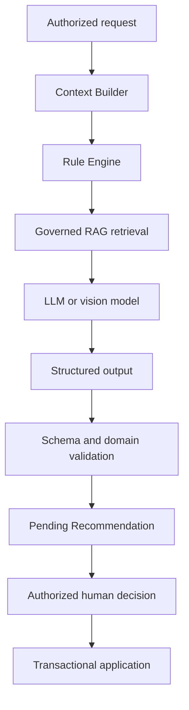

# AI subsystem

AI Assistance is a shared capability for `SELF_DIRECTED` Students and Trainers operating in `HUMAN_COACH`. It is not a third Coaching Mode, not the system of record, and not a business decision maker.

## Supported capabilities

- propose Workout Plans, splits, exercises, replacements, volume, or load changes;
- explain technique and training principles using governed knowledge;
- analyze validated Workout/Progress history;
- help adjust scheduling after missed sessions while respecting recovery and availability;
- summarize progress and identify contextual recommendations;
- assist food recognition, ingredient detection, portion estimation, and structured matching;
- assist Trainers with Student review while preserving Trainer decision authority.

## Required pipeline

## Safety and authority

- The AI service receives minimized context from/through Spring Boot and cannot freely browse the application database.
- Missing values are labelled unavailable; they are never serialized as zero.
- Progress/recovery output considers training continuity and inactivity.
- Unsupported inference is prohibited.
- Rules may require more data or block an otherwise plausible model output.
- Application of accepted output rechecks current versions and authority.

See [context, rules, and RAG](context-rules-rag.md) and [recommendation lifecycle](recommendation-lifecycle.md).

