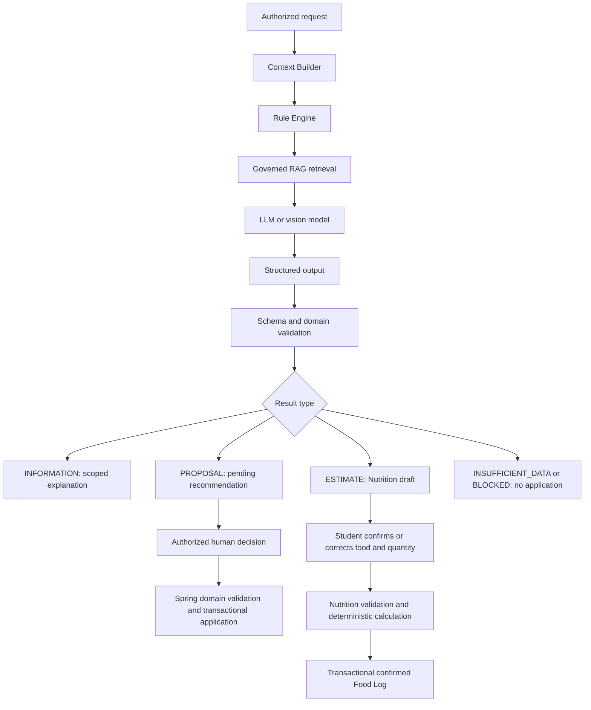

# AI subsystem

AI Assistance is a shared capability for `SELF_DIRECTED` Students and Trainers operating in `HUMAN_COACH`. It is not a third Coaching Mode, not the system of record, and not a business decision maker.

## Phase 2 reading order and status

1. [Release scope — APPROVED](../00-project-overview/phase-2-release-scope.md).
2. [Feature data and authority matrix — APPROVED](phase-2-feature-data-authority-matrix.md).
3. [Implementation plan — APPROVED](../07-development/phase-2-implementation-plan.md).

The documents are APPROVED version 1.0 by the project owner on 2026-10-04 and distinguish inherited invariants from release decisions. DTO names, reason codes, expiry values and retry storage specify design intent, not implemented contracts. Flyway and executable schemas remain the evidence for current database/API structure. The detailed matrix owns the approved DB/API mapping and V1 transaction behavior; this overview summarizes the approved baseline without claiming implementation.

## Supported capabilities

- propose Workout Plans, splits, exercises, replacements, volume, or load changes;
- explain technique and training principles using governed knowledge;
- analyze validated Workout/Progress history;
- help adjust scheduling after missed sessions while respecting recovery and availability;
- summarize progress and identify contextual recommendations;
- assist food recognition, ingredient detection, portion estimation, and structured matching;
- assist Trainers with Student review while preserving Trainer decision authority.

## Required pipeline

```mermaid
flowchart TB
    Request["Authorized request"] --> Context["Context Builder"]
    Context --> Rules["Rule Engine"]
    Rules --> Retrieval["Governed RAG retrieval"]
    Retrieval --> Model["LLM or vision model"]
    Model --> Structured["Structured output"]
    Structured --> Validate["Schema and domain validation"]
    Validate --> Kind{"Result type"}
    Kind --> Information["INFORMATION: scoped explanation"]
    Kind --> Recommendation["PROPOSAL: pending recommendation"]
    Kind --> Estimate["ESTIMATE: Nutrition draft"]
    Kind --> Limited["INSUFFICIENT_DATA or BLOCKED: no application"]
    Recommendation --> Decision["Authorized human decision"]
    Decision --> Apply["Spring domain validation and transactional application"]
    Estimate --> Confirm["Student confirms or corrects food and quantity"]
    Confirm --> Nutrition["Nutrition validation and deterministic calculation"]
    Nutrition --> FoodLog["Transactional confirmed Food Log"]
```

## Safety and authority

- The AI service receives minimized context from/through Spring Boot and cannot freely browse the application database.
- Missing values are labelled unavailable; they are never serialized as zero.
- Progress/recovery output considers training continuity and inactivity.
- Unsupported inference is prohibited.
- Rules may require more data or block an otherwise plausible model output.
- Application of accepted output rechecks current versions and authority.

See [context, rules, and RAG](context-rules-rag.md) and [recommendation lifecycle](recommendation-lifecycle.md).

## Result boundaries

INFORMATION has no application action. A validated PROPOSAL becomes a recommendation with the domain's responsible decision maker. ESTIMATE remains a Nutrition draft and uses Food Confirmation, not recommendation Apply. Operational Run state is separate from result type and reason code; see matrix section 1.6. These result labels are the Phase 2 approved design vocabulary, not additional database enum values.
